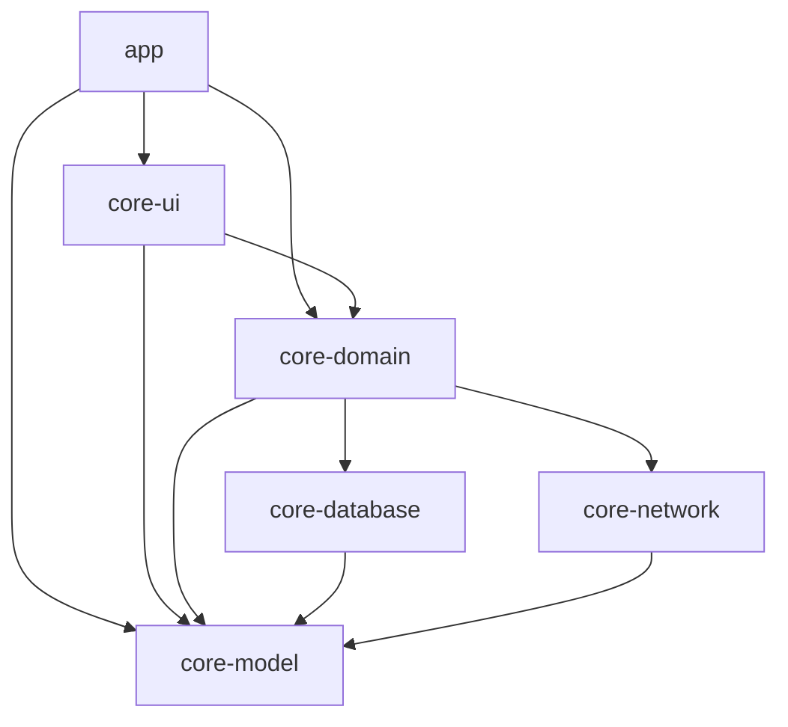

# Android Modular Architecture Example

## Objective

This repository showcases a modern Android application architecture using a modular approach. The primary goal is to demonstrate a scalable, maintainable, and testable codebase by separating concerns into distinct modules. This architecture is designed to support a clean dependency flow, ensuring that each module has a well-defined responsibility.

## Modules

The application is divided into the following modules:

- **`:app`**: The main application module, responsible for assembling the final Android application. It integrates all other modules and handles application-level concerns such as dependency injection setup and navigation. This module depends on `:core-ui`, `:core-domain`, and `:core-model`.

- **`:core-ui`**: This module contains all the UI-related components, such as Activities, Fragments, Composables, ViewModels, and UI-specific logic. It is responsible for rendering the user interface and handling user interactions. This module depends on `:core-domain` and `:core-model`.

- **`:core-domain`**: The domain module contains the business logic of the application. It defines the use cases and repository interfaces that orchestrate the flow of data between the UI and data layers. This module is independent of any specific UI or data implementation, making it highly reusable and testable. It depends on `:core-database`, `:core-network`, and `:core-model`.

- **`:core-database`**: This module is responsible for all database-related operations. It contains the Room database definition, DAOs (Data Access Objects), and entity mappings. It provides a concrete implementation of the database repository interfaces defined in `:core-domain`. This module depends on `:core-model`.

- **`:core-network`**: This module handles all network-related operations. It includes the Retrofit service definitions, API data transfer objects (DTOs), and the implementation of the network repository interfaces from `:core-domain`. This module depends on `:core-model`.

- **`:core-model`**: The model module contains the data classes (POJOs/POCOs) that are shared across all other modules. These models represent the application's data structures and are used for communication between the different layers of the application. This module has no dependencies on other modules in this project.

## Dependency Diagram

## Tech Stack & Open-source Libraries

- **Kotlin**: The primary programming language.
- **Coroutines**: For asynchronous programming.
- **Hilt**: For dependency injection.
- **Jetpack Compose**: For building the UI.
- **ViewModel**: To store and manage UI-related data.
- **Room**: For local database storage.
- **Retrofit**: For making HTTP requests.
- **OkHttp**: As the HTTP client for Retrofit.
- **Gson**: For JSON serialization/deserialization.
- **Material Design**: For UI components.
- **JUnit, Mockito, Turbine**: For unit and UI testing.
